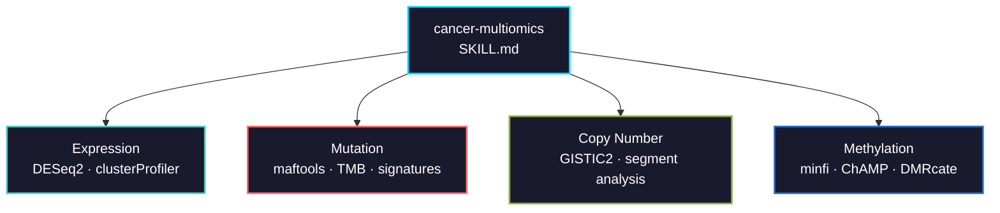

# cancer-multiomics

Multi-omics analysis skill for TCGA and GEO cancer datasets. Covers four data types with tested protocols and correct defaults.



## Usage

```bash
# Claude Code
cp SKILL.md your-project/.claude/skills/

# Cursor
cp SKILL.md your-project/.cursor/skills/
```

## Validation

Tests in [`tests/`](tests/) run against TCGA-LUAD and check:

- Expression: DEG counts, sample counts, gene pre-filtering
- Mutation: TP53/KRAS/EGFR frequencies, TMB range, EGFR-KRAS mutual exclusivity
- CNV: segment interpretation, gain/loss classification, gene-level mapping
- Methylation: beta-value range, M-value conversion, DMP detection

```bash
Rscript tests/run_all.R          # run everything
Rscript tests/run_all.R expression  # run one
```
