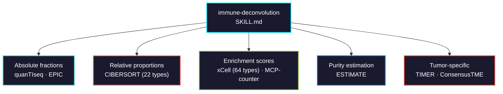

# immune-deconvolution

Estimate immune and stromal cell composition from bulk RNA-seq. Covers 9 methods through the immunedeconv unified interface, plus BayesPrism for single-cell-reference-based deconvolution.



## Usage

```bash
# Claude Code
cp SKILL.md your-project/.claude/skills/

# Cursor
cp SKILL.md your-project/.cursor/skills/
```

## Methods at a glance

| Method | Output type | Cell types | Input |
|--------|------------|------------|-------|
| quanTIseq | Absolute fractions | 10 immune + other | TPM |
| EPIC | Absolute fractions | 6 immune + cancer | TPM |
| CIBERSORT | Relative fractions | 22 immune subtypes | TPM (registration required) |
| xCell | Enrichment scores | 64 types | TPM |
| MCP-counter | Arbitrary scores | 8 immune + 2 stromal | TPM |
| TIMER | Regression scores | 6 immune | TPM + cancer type |
| ESTIMATE | Composite scores | Immune, stromal, purity | TPM |
| BayesPrism | Absolute fractions | Custom (from scRNA-seq) | Counts |
