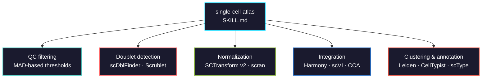

# single-cell-atlas

Single-cell RNA-seq QC, preprocessing, integration, clustering, and cell type annotation. Dual-language: Seurat v5 (R) and scanpy (Python).



## Usage

```bash
# Claude Code
cp SKILL.md your-project/.claude/skills/

# Cursor
cp SKILL.md your-project/.cursor/skills/
```

## Languages covered

| Step | R (Seurat v5) | Python (scanpy) |
|------|---------------|-----------------|
| QC metrics | `PercentageFeatureSet()` | `sc.pp.calculate_qc_metrics()` |
| MAD filtering | Manual or `scater::isOutlier()` | Manual MAD computation |
| Doublets | `scDblFinder()` | `sc.pp.scrublet()` |
| Normalization | `SCTransform()` or `NormalizeData()` | `sc.pp.normalize_total()` + `log1p()` |
| Feature selection | `FindVariableFeatures()` | `sc.pp.highly_variable_genes()` |
| Integration | `IntegrateLayers()` / `RunHarmony()` | `harmony_integrate()` / scVI |
| Clustering | `FindClusters(algorithm=4)` | `sc.tl.leiden()` |
| Annotation | scType | CellTypist |
