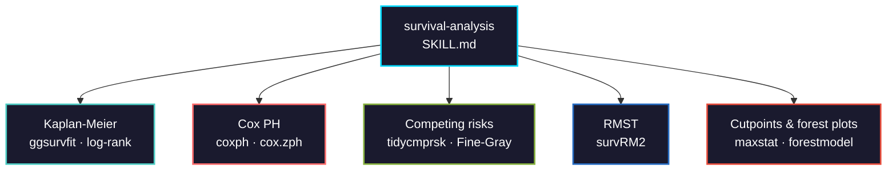

# survival-analysis

Time-to-event analysis for cancer clinical data. Covers the full pipeline from Kaplan-Meier estimation through Cox regression, competing risks, and RMST.



## Usage

```bash
# Claude Code
cp SKILL.md your-project/.claude/skills/

# Cursor
cp SKILL.md your-project/.cursor/skills/
```

## Methods covered

| Method | Package | Use case |
|--------|---------|----------|
| Kaplan-Meier | survival, ggsurvfit | Non-parametric survival curves with risk tables |
| Log-rank test | survival | Two-group or multi-group comparison |
| Cox PH | survival | Multivariate hazard ratio estimation |
| PH diagnostics | survival (cox.zph) | Schoenfeld residuals, time-varying coefficients |
| Competing risks | tidycmprsk | Cause-specific and Fine-Gray subdistribution hazards |
| RMST | survRM2 | Alternative to HR when PH violated |
| Optimal cutpoints | survminer, maxstat | Data-driven biomarker thresholds (with validation caveats) |
| Forest plots | forestmodel | Multivariate Cox results visualization |
